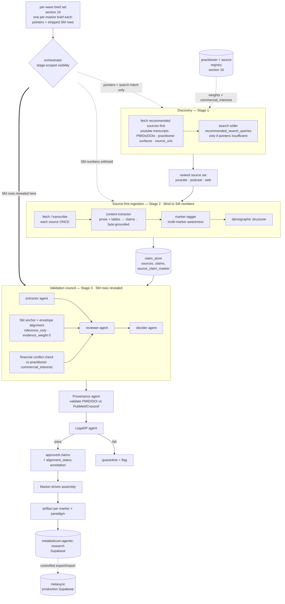

# Architecture overview

The pipeline has three stages, three cross-cutting agents (council, provenance, legal), an assembly step, and a controlled migration to production. It is triggered per wave — a wave is a collection of markers — by that wave's set of research briefs (section 19), and ends in approved per-marker claims exported to `metasync`. The pipeline diagram is reproduced below in Mermaid.

## Trigger and unit of work

The pipeline is triggered per wave. A wave is a collection of markers — the brief set under `input/hermes-briefs/<wave>/`, one `<marker>.yaml` brief per marker (for example, wave-0 is the five pilot markers). Each brief is a search seed only: it carries compact pointer lists — recommended YouTube video IDs, practitioners, PMIDs, DOIs, source URLs, and search queries — plus stripped SM anchor rows reserved for later alignment. A brief is never evidence and is never modified by the run.

Three scopes coexist and must not be conflated:

- The trigger is per wave. One run processes all markers in the wave as a batch, drawing their briefs from `input/hermes-briefs/<wave>/`.
- Discovery and Stage 2 are per source, shared across the whole wave. The source, not the marker, is the unit of ingestion work, so a source is fetched and extracted exactly once and serves every marker in the wave it discusses.
- Assembly is per marker. Stage 4 collects every approved claim tagged with a marker and emits one artifact per marker-paradigm pair.

The two-tier ingestion design addresses the wasted-evidence problem, and processing a wave as a batch is what makes it pay off. A single ninety-minute podcast might cover ApoB, Lp(a), TG/HDL, fasting insulin, and HbA1c — all five wave-0 markers. Treating each marker as its own run means transcribing five times and risking that the agent extracts subtly different claims on different runs. The fix is that within a wave a source is fetched and transcribed exactly once. The content extractor walks the entire source — transcript paragraphs, HTML tables, PDF table cells, and image-based tables via OCR — and emits every metabolic claim it finds. A significant share of reference ranges and thresholds live in tables rather than running prose; omitting table extraction would silently lose embedded numeric evidence. Each claim carries an `applies_to_markers` field populated by the marker tagger. For any marker, we then query the claim store for claims tagged with that marker, pass them through council and legal, and emit the per-marker artifact. One source produces many claims, one claim can serve many markers, and the per-marker artifact remains the canonical handoff to production. Adding a sixth marker that the podcast already discussed is a database SELECT and a council pass, not a re-fetch.

## SM ranges are an alignment reference, never an input

The SM anchor rows travel inside the brief, but the orchestrator controls which stage may see them. Discovery and extraction never receive the SM numbers. Discovery is steered only by marker identity, units, risk direction, and the brief's search queries. Extraction is fully blind and must ground every value byte-for-byte in a fetched source. The SM rows are revealed only to the validation council, after extraction, where they are used solely to classify each already-extracted claim as `aligned`, `wider_than_envelope`, `narrower_than_envelope`, `contradictory`, or `not_comparable` (section 17). They carry `evidence_weight: 0`, are never an input range, never raise a grade or score, and never enter a claim's value. The comparison is stored as a separate `alignment_status` annotation, not merged into the claim.

This visibility firewall is structural, not advisory. A value the extractor never sees is a value it cannot anchor on or fabricate toward. The brief may physically contain the SM rows because it is the per-marker bundle; enforcement lives in the orchestrator, which injects the SM block only into the council prompt. [JUDGMENT] Withholding the numbers from extraction is the primary defense against SM-adjacent fabrication, given the project's zero-fabrication rule and prior citation-fabrication incidents.

## Discovery scope (basic research)

Basic research discovery covers YouTube, podcasts, and permissive public web and practitioner surfaces, plus PMID, DOI, and Crossref resolution, with the brief's fallback search queries. Hermes fetches the brief's recommended sources first and widens to the search queries only when curated pointers are absent, fail, or are insufficient. X/Twitter, Telegram, and LinkedIn discovery are deferred to the content-discovery maintenance phase (section 3) and are out of scope for basic research. The Meta agent remains out of scope.

## Research target envelopes

Research target envelopes are optional inputs to validation, not evidence. They express internal marker-range goals that define what the pipeline is trying to discover, confirm, or falsify from public sources. For basic research the operational envelope is the brief's stripped SM rows, used as the alignment reference described above; section 17 defines the sanitized envelope-fact contract for any richer use. Only sanitized atomic envelope facts and their use-policy flags may enter the council prompt; they never enter discovery or extraction. The private derivation file that explains where an envelope came from is never passed to any stage. When open-source material exposes finer context than a broad internal seed, the pipeline preserves that finer context rather than collapsing it back to a general-adult envelope.

## Agent topology and data-flow rules

The agent topology has three pipeline stages, plus three cross-cutting agents (council, provenance, legal), plus an assembly step. The implementation runner is Hermes (section `hermes-setup.md`). Each agent, regardless of runner, must have a role-locked prompt or instruction set, a strict structured output contract that is a subset or refinement of `BiomarkerClaim`, one named LLM provider per config with no silent fallback, and an input folder and an output folder on disk.

The data-flow rules are straightforward. A run is scoped to a wave — the markers in `input/hermes-briefs/<wave>/`. One source per ingestion run — the source is the unit of work for Stage 2, not the marker, and is shared across every marker in the wave. One marker per assembly run — Stage 4 is marker-scoped. Each stage's output is a file in the next stage's input folder, with filenames encoding source-or-marker, stage, agent, and ISO timestamp. The terminal artifact is one `.sql` file or structured export per marker-paradigm pair, replayable. Failures produce quarantine entries, not silent drops. All pipeline persistence is to the standalone `metabolicum-agentic-research` Supabase project; the `metasync` production database has no pipeline credentials.

## Why this topology

The reasoning behind this topology rests on a few judgments. Three stages plus assembly, separated by file-system boundaries, give us replayability because every intermediate state is a flat file. They give us auditability for the same reason. They give us model diversity because each stage can use a different LLM. They give us controlled parallelism because Stage 1 fans out across a marker's recommended sources and across markers. And they give us evidence non-waste because a source is processed once for all markers it discusses. The tradeoff is that state lives in two places — files and the standalone agentic Supabase project — but this is acceptable because files are write-once-per-run and the database artifact is canonical.
