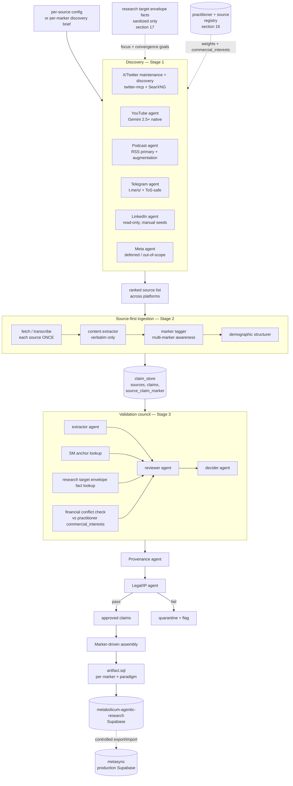

# Architecture overview

The full pipeline has three pipeline stages, two cross-cutting agents, an assembly step, and a controlled migration to production. The pipeline diagram is reproduced below in Mermaid.

The two-tier ingestion design addresses the wasted-evidence problem. A single ninety-minute podcast might cover ApoB, Lp(a), TG/HDL, fasting insulin, and HbA1c. Re-running the pipeline five times means transcribing five times and risking that the agent extracts subtly different claims on different runs. The fix is that a source is fetched and transcribed exactly once. The content extractor walks the entire transcript and emits every metabolic claim it finds. Each claim carries an `applies_to_markers` field populated by the marker tagger. For any marker, we then query the claim store for claims tagged with that marker, pass them through council and legal, and emit the per-marker SQL artifact. One source produces many claims, one claim can serve many markers, and the per-marker SQL artifact remains the canonical handoff to production. Adding a sixth marker that the podcast already discussed is a database SELECT and a council pass, not a re-fetch.

Research target envelopes are optional inputs to discovery and validation, not evidence. They express internal marker-range goals that define what the pipeline is trying to discover, confirm, or falsify from public sources. Only sanitized atomic envelope facts and use-policy flags may be passed into agent prompts or stage inputs. The private derivation file that explains where the envelope came from is never passed to extraction, council, scoring, legal review, assembly, or export. When open-source material exposes finer context than a broad internal seed, the pipeline preserves that finer context rather than collapsing it back to a general-adult envelope.

The agent topology has three pipeline stages, six classes of agents, plus two cross-cutting agents (Provenance and Legal), plus an assembly step. The implementation framework is deliberately deferred. Each agent, regardless of runner, must have a role-locked prompt or instruction set, a strict structured output contract that is a subset or refinement of BiomarkerClaim, one named LLM provider per config with no silent fallback, and an input folder and an output folder on disk.

The data flow rules are straightforward. One source per ingestion run — the source is the unit of work for Stage 2, not the marker. One marker per assembly run — Stage 4 is marker-scoped. Each stage's output is a file in the next stage's input folder, with filenames encoding source-or-marker, stage, agent, and ISO timestamp. The terminal artifact is one `.sql` file or structured export per marker-paradigm pair, replayable. Failures produce quarantine entries, not silent drops. All pipeline persistence is to the standalone `metabolicum-agentic-research` Supabase project; the `metasync` production database has no pipeline credentials.

The reasoning behind this topology rests on a few judgments. Three stages plus assembly, separated by file-system boundaries, give us replayability because every intermediate state is a flat file. They give us auditability for the same reason. They give us model diversity because each stage can use a different LLM. They give us controlled parallelism because Stage 1 is N parallel platform-agents. And they give us evidence non-waste because a source is processed once for all markers it discusses. The tradeoff is that state lives in two places — files and the standalone agentic Supabase project — but this is acceptable because files are write-once-per-run and the database artifact is canonical.
