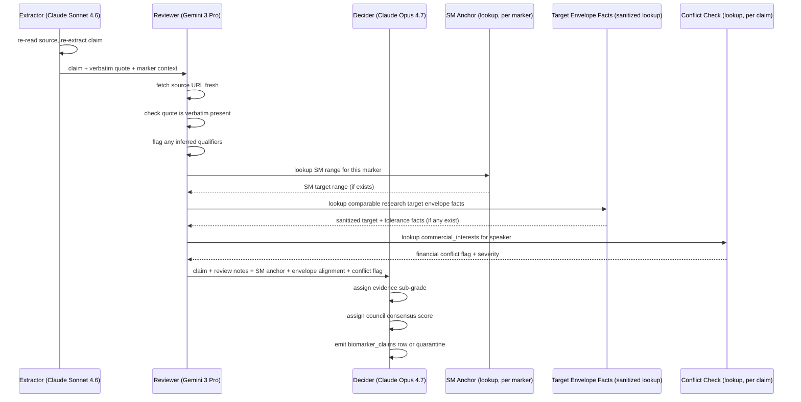

# Validation council

Stage 3 is automated by default, with explicit quarantine for any claim that cannot be safely accepted. The council must fail safely: when in doubt, claims go to quarantine instead of being silently dropped or promoted. The pattern is extractor, then reviewer, then decider, using three different model families so that a hallucination must survive three independent checks across different architectures.

The council runs once per claim-marker pair. Because one claim can serve multiple markers, a claim about both ApoB and Lp(a) gets two council passes — the verbatim quote and source are identical between them, but the marker-specific sanity-anchor check and the evidence-grade interpretation differ. `[JUDGMENT]` The extractor work in Stage 2 is shared across markers; only the council pass duplicates. This is the right tradeoff for full multi-marker coverage of every source.

The sequence diagram is straightforward:

The financial conflict check looks up the speaker in the section-sixteen practitioner/source registry, examines their `commercial_interests` entries, and flags the claim if any commercial interest's `related_markers` list contains the marker currently being validated. The check emits both `financial_conflict_flag` and `financial_conflict_severity`.

Conflict severity controls review posture. `generic` conflicts are surfaced but do not change the review path. `marker_specific` conflicts trigger enhanced scrutiny: the reviewer verifies that the claim is not merely an advertisement and looks for independent corroboration. `direct_competitor` and `undisclosed` conflicts go to quarantine pending manual review. The flag and severity are surfaced in the dashboard and in the BiomarkerClaim record so that downstream consumers, including end users of Metabolicum, can see the conflict transparently.

Model diversity is the point of the council. Du, Li, Torralba, Tenenbaum, and Mordatch (2023) in arXiv:2305.14325 (retrieved 2026-05-13) show that multi-agent debate "improves the factual validity of generated content, reducing fallacious answers and hallucinations." This has been replicated by Liang et al. (2024) and Yang et al. (2025) in MDPI Applied Sciences, cited together in Springer Nature 2025 (doi:10.1007/s44443-025-00353-3, retrieved 2026-05-13). `[JUDGMENT]` We are not running full back-and-forth debate because the gain plateaus after the first cross-check. Linear extractor-reviewer-decider captures the useful validation pattern while keeping the workflow simple and auditable.

Verbatim quote enforcement at the schema level is the single most important check in the pipeline. The schema validator rejects empty `verbatim_quote` values before council review. The reviewer re-fetches the source URL fresh — not from the cached transcript, but from the URL. The quote must appear as a substring of the fetched content, after whitespace normalization. If it does not, the claim is rejected. This catches extractor-hallucinated quotes, sources that changed between extraction and review, and wrong URLs.

If the source URL is temporarily unreachable during re-fetch, the reviewer does not approve from memory. The claim moves to quarantine with `rejection_stage: 'reviewer'` or `provenance`, `rejection_codes` including `source_unreachable`, and a note describing whether a cached transcript, archived snapshot, or previously fetched source artifact exists. Cached artifacts can support later human review, but they do not bypass the fresh-fetch requirement for automated approval.

The Standard Medical anchor functions as a sanity check. The decider uses the hand-curated `sm_anchors` table, one row per marker and population context where available. Wildly out-of-range MO recommendations get a `paradigm_divergence_flag: extreme` value. This does not auto-reject — MO is expected to diverge from SM, that is the point of the paradigm — but it surfaces edge cases for review.

Research target envelope facts function as convergence checks. The reviewer compares each claim against sanitized envelope facts (same marker, paradigm, unit, and compatible context) per the section-seventeen contract, and the council writes the result to `claim_envelope_evaluations`. The optional `primary_envelope_alignment_status` on the claim row is a dashboard convenience. These signals prioritize more research and surface contradictions; they never approve a claim, raise an evidence grade, replace a citation, or justify publication.

The decider may change the extractor's proposed paradigm when the source evidence supports a different classification. Paradigm reassignment is recorded in the review notes with the original value, revised value, and reason. If the paradigm remains ambiguous after review, the claim is quarantined rather than forced into a category.

For hallucination detection more broadly, we have surveyed the 2025–2026 literature (arXiv:2406.03075 on Markov-Chain Multi-agent Debate; arXiv:2603.28488 on Courtroom-Style Multi-Agent Debate with Progressive RAG; arXiv:2406.11514 on Counterfactual Debating with Preset Stances; all retrieved 2026-05-13) and adopt five techniques. Verbatim quote enforcement at the schema level is the primary defense. Multi-model cross-validation across three families is the secondary defense. Counterfactual debating in the CFMAD style is `[JUDGMENT]` considered but not adopted for the first implementation because the linear pipeline is easier to audit at our scale; we revisit if claims regularly survive but turn out wrong on user audit. Self-consistency sampling runs the extractor at temperature zero, with subjective extractions requiring three-run agreement. Citation grounding through reviewer re-fetching is built into the sequence above.

There are techniques we explicitly do not rely on. We do not use LLM-as-judge for free-form quality scoring, because calibration drifts, sycophancy is endemic, and models prefer their own outputs. We use LLMs as judges only for binary, schema-constrained checks of the form "does this string appear in this fetched page: yes or no." We do not implement Constitutional AI in the strict Anthropic sense, because it is too vague for our needs; the constraints are baked into the schema contract directly. We do not rely on self-grading confidence alone — confidence values are recorded for downstream calibration but are never the sole gate.

Council testing uses a small golden set before a marker is trusted: known-good claims with fetchable quotes, known-bad hallucinated quotes, wrong-marker claims, wrong-paradigm claims, and conflict-heavy claims. The goal is not to prove the models are correct in general; it is to verify that the contract rejects predictable failure modes before production export.

The output is either a post-council `biomarker_claims` row, one per marker the underlying claim serves, or a `quarantine` row with reason codes. When sanitized envelope facts exist, the council also writes `claim_envelope_evaluations` rows for comparable claim-envelope pairs. Quarantine is part of the research record: it preserves what failed, where it failed, and whether a later reviewer or improved source fetch can re-open the item.
